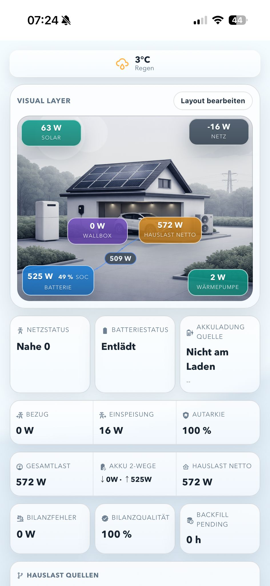
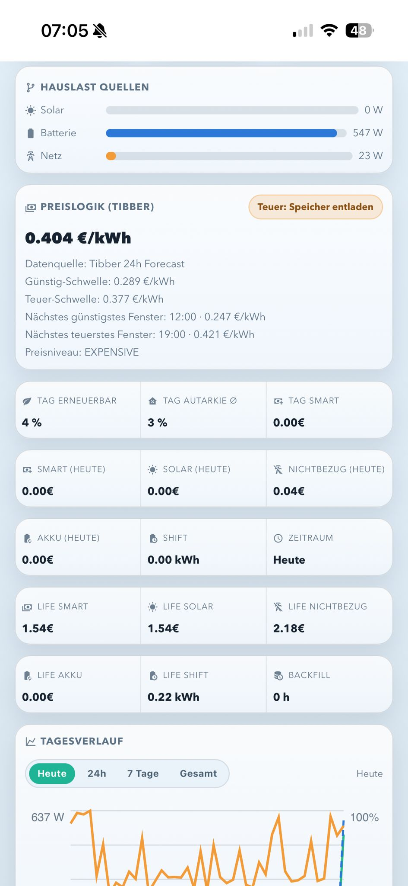
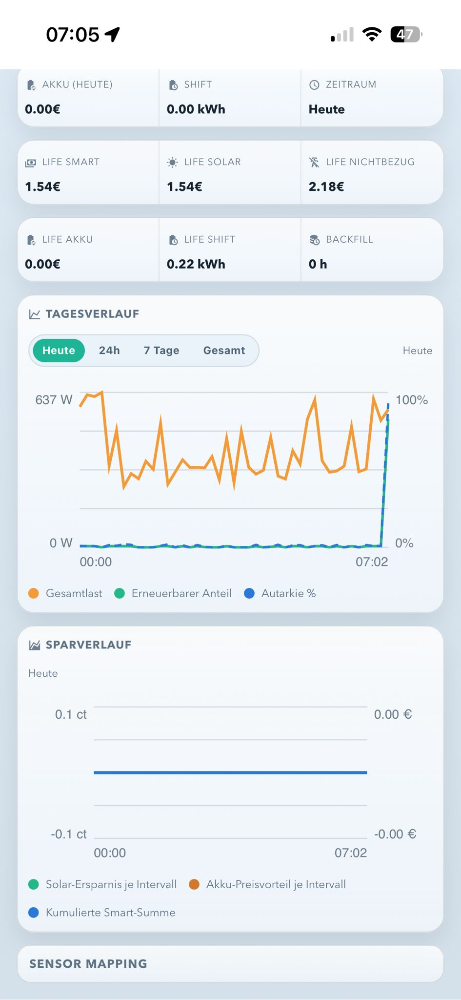

# Energy Dashboard Panel (Home Assistant)

Custom Panel fuer Home Assistant mit Fokus auf:

- Solar, Netz, Batterie, Hauslast (inkl. signed/dual Sensor-Logik)
- Tibber Preislogik direkt per API Token
- Open-Meteo Wetter (kostenlos, nur Ort noetig)
- Drag-and-Drop Visual Layer mit frei platzierbaren Chips
- Tagesverlauf + Sparstatistiken + Lifetime-Sensoren

## Screenshots

<p align="center">
  
  
  
</p>

## Projektstruktur

```text
custom_components/
  energy_dashboard_panel/
    __init__.py
    const.py
    sensor.py
    manifest.json
    frontend/
      energy-dashboard-panel.js
```

## Installation (Home Assistant)

1. Ordner `custom_components/energy_dashboard_panel` nach `/config/custom_components/` kopieren.
2. In `configuration.yaml` konfigurieren.
3. Home Assistant neu starten.

Minimalbeispiel:

```yaml
energy_dashboard_panel:
  sidebar_title: "Energie"
  sidebar_icon: "mdi:solar-power-variant"
  url_path: "energie-dashboard"
  require_admin: false
  background_image: /energy_dashboard_panel_panel/dashboard.png?v=1

  # Kostenloses Wetter (Open-Meteo)
  weather_location: "Berlin,DE"

  # Tibber API (ohne Tibber Integration)
  tibber_api_token: !secret tibber_api_token
  # tibber_home_id: "optional_home_id"

  sensors:
    solar_power: sensor.pv_gesamtleistung
    load_power: sensor.hausverbrauch_watt
    grid_import_power: sensor.netzbezug_w
    grid_export_power: sensor.netzeinspeisung_w
    battery_power: sensor.batterie_leistung
    battery_soc: sensor.batterie_soc
```

Hinweis zum Hintergrundbild:

- Datei im Projekt: `custom_components/energy_dashboard_panel/frontend/dashboard.png`
- Oeffentliche URL in der YAML: `/energy_dashboard_panel_panel/dashboard.png?v=1`
- Bei Bildaenderung einfach die Versionszahl (`?v=2`, `?v=3`) erhoehen.

## GitHub: Repo erstellen und pushen

```bash
git init
git add .
git commit -m "Initial commit: energy dashboard panel"
git branch -M main
git remote add origin https://github.com/<USER>/<REPO>.git
git push -u origin main
```

## Sicherheit

- Niemals API Tokens direkt committen.
- Immer `!secret tibber_api_token` verwenden und `secrets.yaml` lokal halten.
